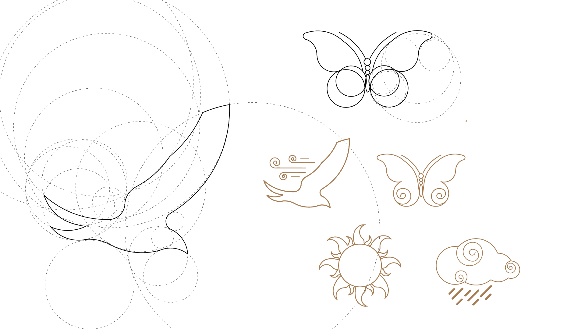

# Soundly Sky Icons

The Soundly Sky Icons were created for the Music Mixer project (IDP3 - Fanshawe College).  
All of them have the sky as inspiration. 
The icon set was made using Adobe Illustrator.

## Assignment Requirements

"Use Terminal, Git and Github to create the project structure and a linked repository. Create a
minimum of 10 SVG icons in Illustrator - the theme is up to you. 
Use CSS to organize the icons on an HTML page with some branding and a (very) brief
description for each. You can choose how you want to implement this - as an image tag source,
as an SVG tag, or using the object tag. 
Use CSS interactions or transitions to change the icon’s appearance (on hover, as an example,
reverse all of the colours or add a drop shadow, etc). 
When clicked, toggle a “selected” CSS class on the active icon and log a message to the
console with the ID of the element that you’ve clicked. The ID should be retrieved and displayed
with a JavaScript string template and variable (refer to the class example)."

Trevor Van Rys - Multimedia Authoring 2 - SVG Icon MarketPlace

## Credits

All icons were made by Cristine de Noronha

## License 
MIT
